# MSuite — Provider

The **provider** half of a two-bench SaaS split. MSuite owns the commercial
truth for every customer — what they bought, what that entitles them to, and
which third-party accounts they've connected — and pushes that truth to
customer-owned Frappe sites running the `msuite_workspace` app.

```
 provider bench                              client bench
 ┌─────────────────────────┐                 ┌──────────────────────────┐
 │ msuite  (this app)      │  plan + creds   │ msuite_workspace         │
 │                         │ ──────────────► │                          │
 │ • products & plans      │                 │ • enforces the plan      │
 │ • subscriptions/billing │ ◄────────────── │ • runs the product UI    │
 │ • entitlement resolver  │  webhook ACKs   │ • never talks to Meta    │
 │ • OAuth token custody   │                 │   directly               │
 └─────────────────────────┘                 └──────────────────────────┘
```

The asymmetry is deliberate. Client sites hold **no** app secrets and never
complete an OAuth handshake. The provider owns every Meta/Google/LinkedIn app
registration, performs every token exchange, and forwards only a scoped access
token plus metadata downstream. A compromised client site cannot mint new
tokens or read another tenant's credentials.

- **Runs on:** Frappe v16 + ERPNext (`required_apps = ["erpnext"]`)
- **Version:** `1.0.0` (`msuite/__init__.py`, mirrored in `hooks.py`)
- **Scale of app:** 26 DocTypes, 145 Python modules, 7 Frappe modules
- **Meta Graph API:** `v25.0`

---

## Table of contents

1. [Architecture](#1-architecture)
2. [Domain model](#2-domain-model)
3. [Entitlement resolution](#3-entitlement-resolution)
4. [Subscription lifecycle](#4-subscription-lifecycle)
5. [Bundles and complimentary grants](#5-bundles-and-complimentary-grants)
6. [Customer Groups and Pricing Rules](#6-customer-groups-and-pricing-rules)
7. [Provider → client sync](#7-provider--client-sync)
8. [OAuth and connected accounts](#8-oauth-and-connected-accounts)
9. [WhatsApp Embedded Signup](#9-whatsapp-embedded-signup)
10. [Webhook ingress and durable delivery](#10-webhook-ingress-and-durable-delivery)
11. [AI Calling routing hub](#11-ai-calling-routing-hub)
12. [Gmail relay](#12-gmail-relay)
13. [The reverse proxy](#13-the-reverse-proxy)
14. [Payments and coupons](#14-payments-and-coupons)
15. [Scheduled tasks](#15-scheduled-tasks)
16. [DocType reference](#16-doctype-reference)
17. [API reference](#17-api-reference)
18. [Reports, workspace, patches](#18-reports-workspace-patches)
19. [Install and configuration](#19-install-and-configuration)
20. [Known issues and sharp edges](#20-known-issues-and-sharp-edges)

---

## 1. Architecture

MSuite separates **billing** (ERPNext's native Subscription / Sales Invoice /
Payment Entry) from **access rights** (MSuite Grants). ERPNext decides who has
paid. MSuite decides what that buys. The two meet at exactly one seam: the
`Subscription Plan → Item → MSuite Plan` resolution.

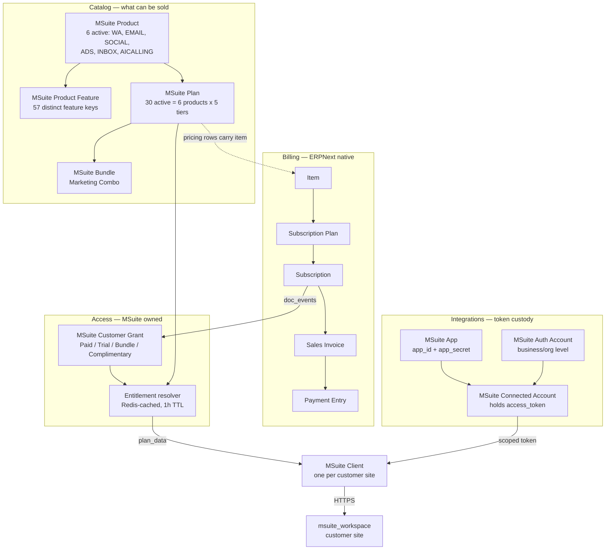

**Module layout**

```text
msuite/
├── hooks.py                 # doc_events, scheduler_events, fixtures
├── constants.py             # tiers, statuses, TTLs, Graph version, error codes
├── exceptions.py            # typed MSuiteError hierarchy
├── install.py               # after_install: roles, custom fields, seeds
├── permissions.py           # has_permission for MSuite Customer Grant
├── patches.txt              # 8 migration patches
│
├── api/v1/                  # whitelisted HTTP surface
│   ├── ai_calling.py        # DID registry + FastAPI-backend routing hub
│   ├── auth.py              # OAuth start/callback, Connect page config
│   ├── bundle.py            # bundle catalog queries
│   ├── coupon.py            # coupon validation + usage history
│   ├── entitlement.py       # feature checks, cache invalidation
│   ├── gmail_relay.py       # send/poll Gmail on behalf of clients
│   ├── payment.py           # payment requests + gateway webhooks
│   ├── plan.py              # plan catalog + comparison
│   ├── subscription.py      # create/cancel/amend
│   └── webhook.py           # Meta/Gmail/Twitter/LinkedIn ingress + forwarding
│
├── services/                # business logic, no HTTP concerns
│   ├── entitlement_service.py   # THE resolver
│   ├── grant_service.py         # grant lifecycle, idempotent
│   ├── subscription_service.py  # ERPNext Subscription orchestration
│   ├── trial_service.py         # trial → paid transition
│   ├── bundle_service.py        # bundle expansion
│   ├── coupon_service.py        # coupon rules
│   ├── customer_group_service.py# Customer Groups + Pricing Rules
│   ├── client_service.py        # ALL provider→client HTTP
│   ├── payment_service.py       # HMAC verify, Payment Entry creation
│   └── oauth/                   # 12 modules, see §8
│
├── hooks_handlers/
│   ├── subscription_hooks.py    # after_insert / on_update
│   ├── invoice_hooks.py         # on_submit → coupon usage
│   └── client_hooks.py          # on_update / on_trash
│
├── seeds/                   # per-product catalog definitions (6 files)
├── scheduled_tasks/daily.py # 4 daily jobs
├── reports/                 # 4 script reports
├── www/connect.py+html      # public OAuth Connect page
├── public/js/               # connect.js, customer.js
└── utils/                   # cache.py (Redis), validators.py (auth)
```

---

## 2. Domain model

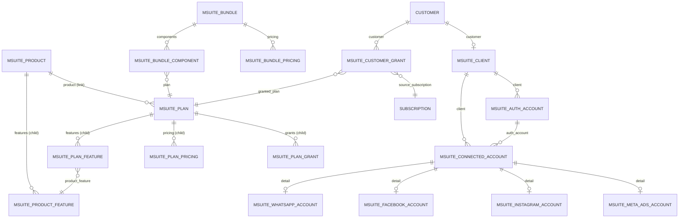

### Naming is load-bearing

Three DocTypes use **field-based autonaming**, which makes the document name
the business key:

| DocType | `autoname` | Consequence |
|---|---|---|
| `MSuite Product` | `field:product_code` | The doc name **is** `"WA"`, `"ADS"`, … — so `MSuite Plan.product` stores the product code the client gates on. No extra lookup. |
| `MSuite Plan` | `field:plan_code` | Doc name is `"WA-BIZ"`, `"SOCIAL-TRIAL"`, … |
| `MSuite Bundle` | `field:bundle_code` | Doc name is `"MARKETING-COMBO"` |

Everything else is `hash`-named, except `MSuite Customer Grant`
(`GRANT-#####`) and `MSuite Coupon Usage` (`CUSG-#####`).

### Two-level gating

The payload pushed to clients carries **both** a product list and a feature
map, and the client gates in that order — first "is this whole module bought?",
then "is this specific feature on?".

Feature keys are only unique *within* a product. Six keys genuinely collide
across products today:

| feature_key | Products |
|---|---|
| `analytics` | EMAIL, WA |
| `templates` | EMAIL, WA |
| `inbox_whatsapp` | INBOX, WA |
| `inbox_facebook` | INBOX, SOCIAL |
| `inbox_instagram` | INBOX, SOCIAL |
| `inbox_seats` | SOCIAL, WA |

This is why `active_products` is computed from **the plan's `product` link**,
not from the parent product of the winning feature row. Deriving it from
feature rows would make those six keys ambiguous.

---

## 3. Entitlement resolution

`services/entitlement_service.py` is the single source of truth for "what can
this customer do right now". Everything else reads through it.

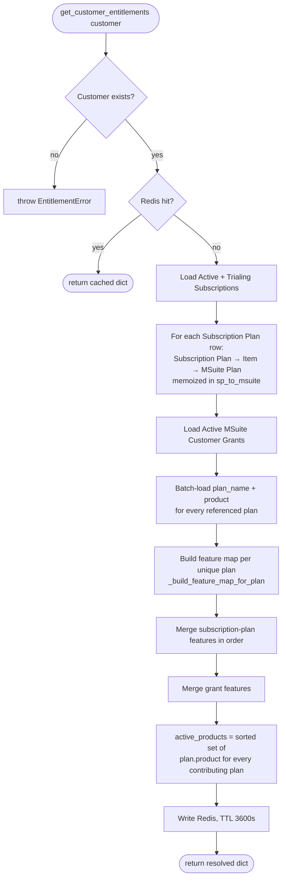

### Merge rules

When two plans supply the same `feature_key`, `_merge_feature_maps` applies:

| Situation | Winner |
|---|---|
| Key absent from base | Incoming |
| Incoming enabled, base disabled | Incoming |
| Both enabled, incoming `limit is None`, base numeric | **Incoming** — `None` means unlimited |
| Both enabled, both numeric | Higher number |
| Incoming disabled, base enabled | Base (incoming ignored) |

So: **enabled beats disabled, unlimited beats any number, higher beats lower.**
The merge never mutates its inputs — it deep-copies each feature dict.

> **Caveat.** `_build_feature_map_for_plan` writes
> `"limit": row.limit_value if row.limit_value else None`. A `limit_value` of
> **`0` is falsy**, so it collapses to `None` and is then treated as
> *unlimited* by the merge. A plan intending "zero allowed" must instead leave
> the feature disabled.

### Resolved shape

```jsonc
{
  "customer": "ACME Corp",
  "resolved_at": "2026-08-07 12:00:00",
  "active_plans": ["WhatsApp Business", "Social Post Pro"],
  "active_products": ["SOCIAL", "WA"],       // sorted product codes
  "active_grants": [
    { "grant_name": "GRANT-00001", "granted_plan": "WA-BIZ",
      "grant_type": "Paid", "expires_on": null }
  ],
  "features": {
    "broadcast": { "enabled": true, "limit": 5000.0,
                   "limit_label": "5000/month", "source_plan": "WhatsApp Business" }
  }
}
```

### Cache discipline

- Key: `msuite:entitlements:<scrubbed customer>` — TTL **3600s**
- Invalidated on every grant create, revoke, and subscription state change
- `POST /api/method/msuite.api.v1.entitlement.invalidate_cache` forces a flush

---

## 4. Subscription lifecycle

ERPNext v16's `Subscription` is **not submittable**. There is no
`on_submit` to hang off — status moves through `Active`, `Trialing`,
`Past Due Date`, `Cancelled`, `Completed`. MSuite therefore binds to
`after_insert` and `on_update`.

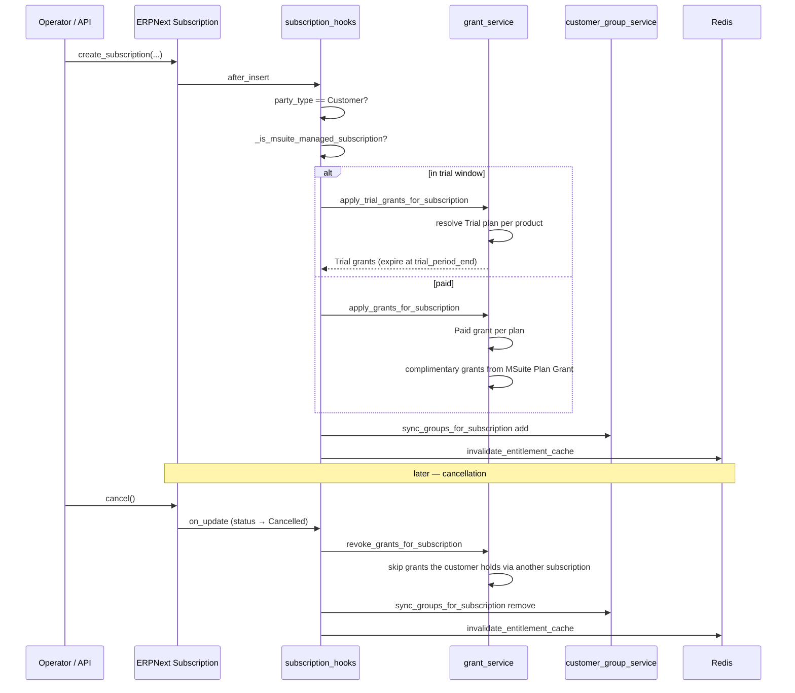

Both hooks are wrapped in `try/except` and log via `frappe.log_error` — a
grant failure never blocks the underlying ERPNext transaction.

**Trial → paid.** A trial grant carries `expires_on = trial_period_end`. The
daily `expire_trial_grants` job finds expired Trial grants and, if the parent
Subscription is still `Active`/`Trialing`, calls
`trial_service.transition_trial_to_paid`; otherwise it revokes. The same
transition is also detected inline by `on_subscription_update`, so it happens
promptly on any save rather than waiting for the nightly run.

**Amendment.** `amend_subscription` cancels the old Subscription, creates a
new one, then calls `apply_grants_after_amendment` — revoke-then-apply, so an
upgrade never leaves the customer briefly unentitled in the *cache* (the DB
write is one transaction).

**Idempotency.** `_apply_single_plan_grant` checks
`(customer, granted_plan, source_subscription, status=Active)` before
inserting and returns the existing name on a hit. Each insert is wrapped in a
`frappe.db.savepoint` so a failure rolls back just that grant.

---

## 5. Bundles and complimentary grants

A **bundle** is an Item flagged `is_msuite_bundle` and linked to an
`MSuite Bundle`. When a Subscription Plan resolves to a bundle item, grants
are created for every component plan.

A **complimentary grant** is a rule on `MSuite Plan.grants` (child DocType
`MSuite Plan Grant`): "buying this plan also grants that plan, optionally
expiring after N days."

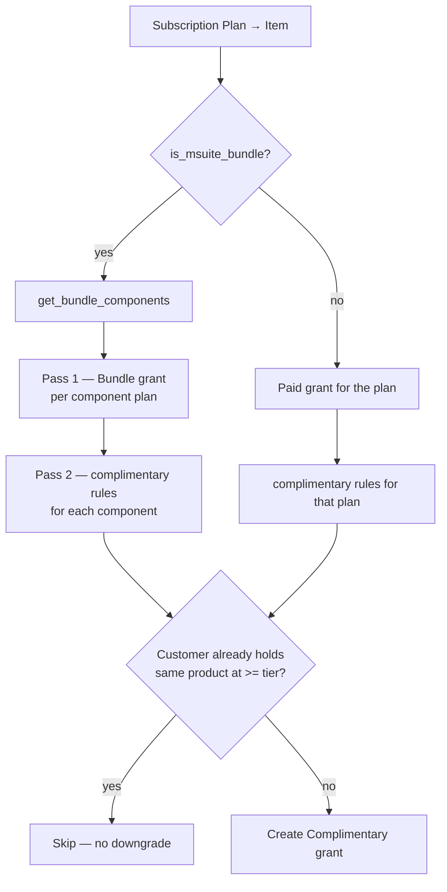

The tier guard ranks `Trial(0) < Basic(1) < Pro(2) < Business(3) <
Enterprise(4)`. It prevents a Business customer from being handed a redundant
Basic grant for a product they already hold at a higher tier. Both the
existing-grant scan and the plan metadata lookup are batch-loaded once per
call rather than per rule.

Bundle grants run in two passes on purpose: every component grant must exist
before complimentary rules fire, or a rule keyed on a sibling component could
evaluate the tier guard against an incomplete picture.

---

## 6. Customer Groups and Pricing Rules

MSuite mirrors entitlements into ERPNext Customer Groups so that **native
Pricing Rules** can discount automatically — no custom pricing code in the
invoice path.

- Group name: `MSuite - {plan_name} Active`, parented under a root `MSuite`
  Customer Group
- Membership lives in a **hidden child table** `msuite_group_memberships` on
  Customer (custom field, `MSuite Customer Group Membership`)
- `sync_pricing_rule_for_grant_rule` creates a Pricing Rule titled
  `MSuite - WA-BIZ → SOCIAL-BASIC (Complimentary)`, applied on Item Code for
  that Customer Group
- Priority `10` for 100 % complimentary, `5` for partial discounts
- Deleting a rule falls back to **disabling** it when ERPNext blocks deletion
  due to historical invoice references

`reconcile_all_groups` runs daily over grants modified in the last **25 hours**
(a deliberate 1-hour overlap on the 24-hour cycle so a job that runs slightly
late cannot skip a window), recomputes expected groups, and adds/removes the
difference.

---

## 7. Provider → client sync

`services/client_service.py` is the **only** module that makes provider→client
HTTP calls. Every request carries `X-MSuite-Provider-Key` and
`X-MSuite-Provider-Secret`, which the client validates in
`validate_provider_auth()`.

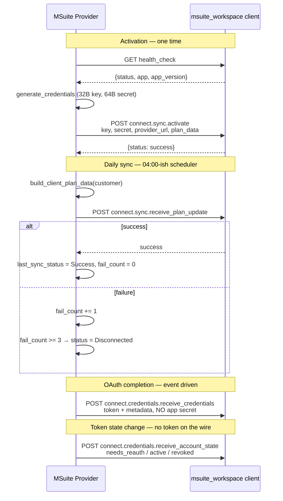

### The `products` key asymmetry

`build_client_plan_data` emits `products` **only when** the resolved
entitlement dict actually contains `active_products`:

```python
if "active_products" in entitlements:
    payload["products"] = entitlements["active_products"]
```

This is not defensive noise. Entitlements are Redis-cached for an hour, so
immediately after a deploy the resolver can still hand back a pre-`products`
dict. The client's `plan_enforcer.get_products` reads an **absent** key as
"legacy payload, don't gate" and an **empty list** as "gate everything". A
`.get("active_products", [])` here would lock every module for every customer
until the cache rolled over.

### Timeouts and failure handling

| Constant | Value | Applies to |
|---|---|---|
| `CLIENT_CONNECT_TIMEOUT` | 10 s | `health_check` probe |
| `CLIENT_PUSH_TIMEOUT` | 15 s | all pushes |
| `CLIENT_SYNC_MAX_FAILURES` | 3 | consecutive daily-sync failures → `Disconnected` |

`push_account_to_client` swallows exceptions and logs — an OAuth flow must
still succeed on the provider even if the client is temporarily unreachable,
because the token has already been minted and stored.

---

## 8. OAuth and connected accounts

Every OAuth handler implements the same three-function contract, registered in
three dicts in `services/oauth/__init__.py`:

```
build_auth_url(client_name, state) -> url
exchange_token(code, state_data)   -> token_data
discover_accounts(client_name, token_data) -> connected_list
```

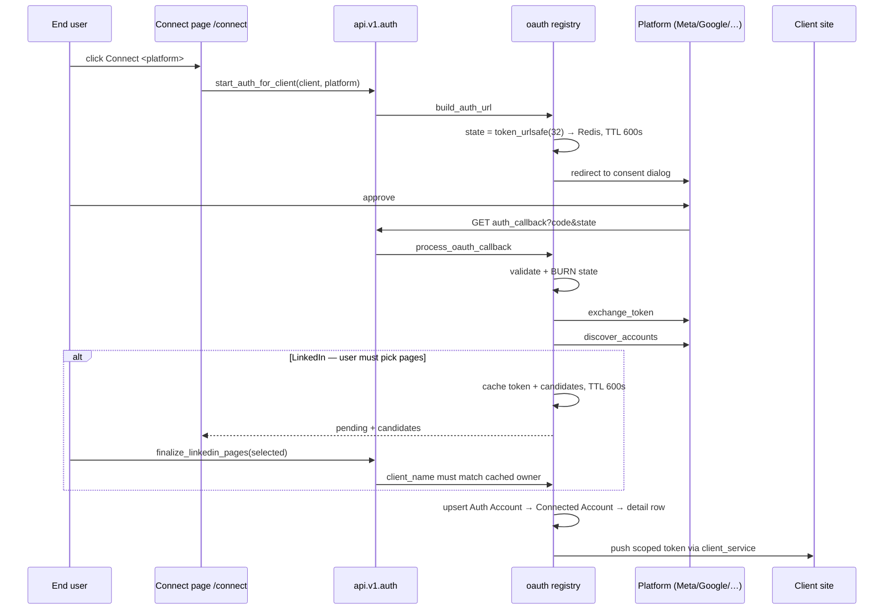

### Registered platform keys

| Key | Handler | Notes |
|---|---|---|
| `meta_social` | `meta_social.py` | Facebook Pages + Instagram Business (organic) |
| `meta_ads` | `meta_ads.py` | Ad accounts (paid) |
| `meta_all` | `meta_all.py` | Combined social + ads consent in one dialog |
| `meta_catalogue` | `meta_catalogue.py` | Product catalogs |
| `linkedin`, `linkedin_page`, `linkedin_profile` | `linkedin.py` | One handler, three keys — the key selects which entity the callback connects |
| `twitter` | `twitter.py` | |
| `google`, `google_youtube`, `google_gmail`, `google_ads` | `google.py` | One handler, four keys |

`meta_social`, `meta_ads`, `meta_all`, and `meta_catalogue` all authenticate
against **one** `MSuite App` record (`platform = "Meta Social"`). They differ
only in requested scopes and which asset class they discover — the shared
auth-URL construction, token exchange, and `/me/businesses` discovery live in
`meta_base.py`, which is deliberately scope-unaware and is never itself
registered as a handler.

### Token refresh

`refresh_expiring_tokens` (daily) selects Active Connected Accounts whose
`token_expiry` falls within **7 days** and dispatches on
`MSuite Connected Account.platform`:

| Platform value | Refresher |
|---|---|
| `Facebook`, `Instagram`, `Meta Ads`, `Meta Catalogue` | `meta_base.refresh_long_lived_token` |
| `LinkedIn` | `linkedin.refresh_token` |
| `Twitter` | `twitter.refresh_token_fn` |
| `YouTube`, `Google Ads`, `Gmail` | `google.refresh_token_fn` |

Meta issues no refresh tokens. Instead an unexpired 60-day long-lived token is
exchanged for a **new** 60-day token via `grant_type=fb_exchange_token`,
resetting the clock. A platform with no registered refresher is marked
`Expired` rather than silently retried.

The richer `services/oauth/refresh.py` is what the daily job actually calls
(`refresh_all_tokens`): it additionally records per-account failure windows,
pushes the refreshed token downstream, notifies the client when an account
enters `needs_reauth`, and emails admins about tokens that cannot be
programmatically refreshed.

### Reconnection revives an account

`upsert_connected_account` sets `status = Active` and `needs_reauth = 0`
whenever a **fresh token** arrives on an existing row — not only on insert.
Webhook routing filters on `status == "Active"`, so without this a previously
disconnected Page would look completely healthy (valid token, subscribed
webhooks) while every inbound event was silently dropped.

---

## 9. WhatsApp Embedded Signup

WhatsApp is **not** in the OAuth registry. Meta's Embedded Signup is a
different flow — the user completes it inside a Facebook JS SDK popup on the
provider's own `/connect` page, and the code is exchanged through
`exchange_whatsapp_code` rather than `process_oauth_callback`.

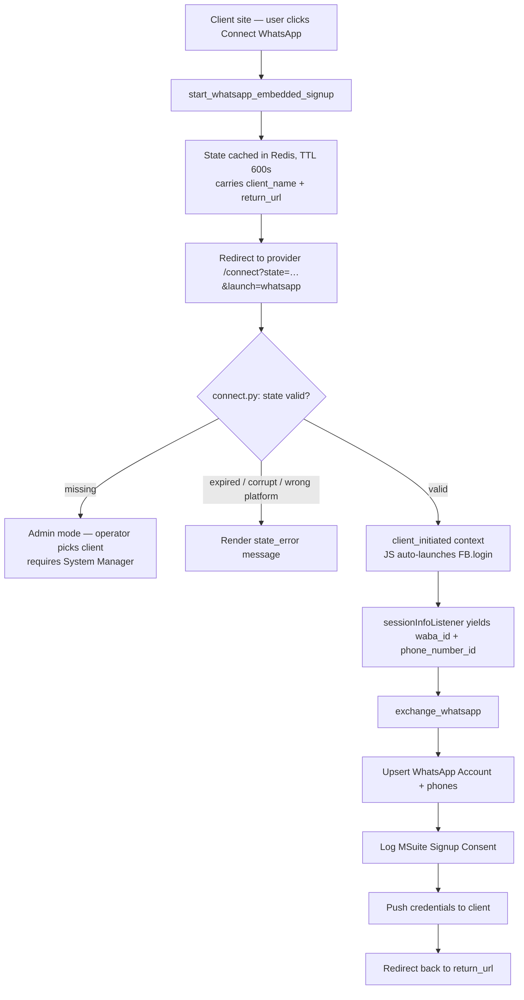

`www/connect.py` sets `no_login_required = 1` because the visitor is an
end-user on the *client's* site, not a provider user. Authentication comes
from the state token, re-validated on every API call. A guest opening
`/connect` with no state gets the admin path, whose data calls require System
Manager — so nothing leaks.

The state is deliberately **not** consumed when rendering the page; only
`exchange_whatsapp` burns it. Otherwise a mid-flow page reload would silently
kill the auto-launch.

`MSuite Signup Consent` records the full consent trail — granted scopes,
granular scopes, `data_access_expires`, raw debug-token response, plus client
environment (IP, user agent, browser, OS, accept-language) captured by
`_capture_client_env()`.

---

## 10. Webhook ingress and durable delivery

The provider owns the Meta app, so **all** webhooks land here and must be
routed to the right tenant. One shared Meta app receives events for every
WABA and Page across all customers.

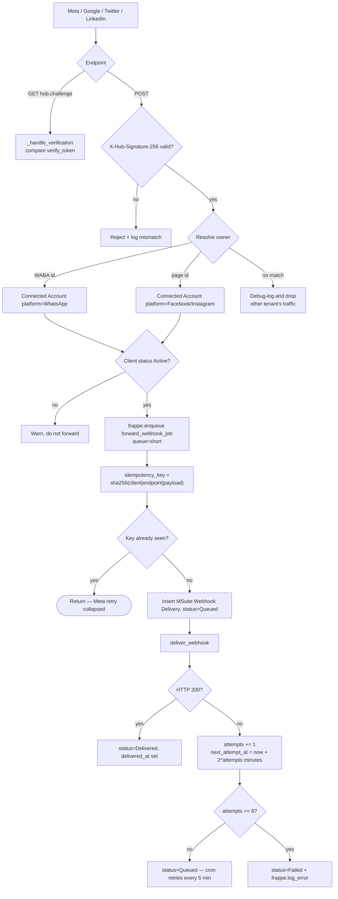

**Why durable.** The provider ACKs Meta immediately. If the client site is
down at that moment, a fire-and-forget forward would lose an event Meta
considers delivered. Every forward is therefore backed by an
`MSuite Webhook Delivery` row.

- **Idempotency:** SHA-256 over `client | endpoint | sorted-JSON payload`.
  Meta retries and duplicate enqueues collapse onto one record.
- **Backoff:** `2^attempts` minutes — 2, 4, 8, … up to ~4 h.
- **Ceiling:** `MAX_FORWARD_ATTEMPTS = 8`, spanning roughly half a day of
  client outage before the row goes `Failed`.
- **Retry driver:** `*/5 * * * *` cron, batched 200 rows per tick.

Signature validation uses `hmac.compare_digest` against the app secret; a
mismatch writes an Error Log with truncated expected/received prefixes and the
body length — never the secret.

Ingress endpoints: `receive_meta_whatsapp`, `receive_meta_social`,
`receive_meta_catalogue`, `receive_gmail_push`, `receive_twitter_events`,
`receive_linkedin` / `receive_linkedin_page` / `receive_linkedin_profile`, plus
`deauthorize_callback` for Meta's app-removal signal.

LinkedIn uses a challenge-response handshake rather than a static verify token
— `_compute_linkedin_challenge_response` HMACs the `challengeCode` with the
app secret.

---

## 11. AI Calling routing hub

The AI Calling FastAPI backend knows **only the provider URL**. It never
learns client site addresses. Each callback carries a DID (or `call_id`),
which the provider resolves to the owning client through the `MSuite AI DID`
registry and forwards using that client's stored credentials.

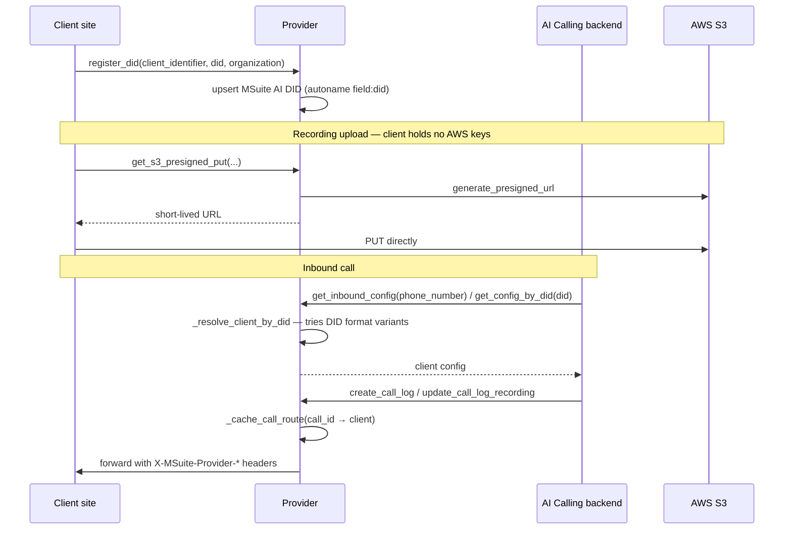

Backend-originated calls are gated by `_require_backend_key()`. `_did_variants`
normalises DID formatting (`+`, leading zeros, country-code variations) so a
backend that reports a number slightly differently still resolves. `call_id`
routing is cached so follow-up callbacks for the same call skip re-resolution.

---

## 12. Gmail relay

Client sites never hold Google refresh tokens. To send or read mail they call
the provider, which holds the token on the `MSuite Connected Account` and
proxies to Gmail's REST API.

- `send_email` — builds a MIME message (HTML + text + attachments, threading
  via `thread_id` / `in_reply_to`) and posts it to Gmail
- `poll_new_messages` — pull-based fallback
- `receive_gmail_push` — Google Pub/Sub push ingress for real-time delivery
- `register_gmail_watch` / `renew_gmail_watches` — Gmail `users.watch`
  registrations **expire after 7 days**, so a daily renewal job keeps push
  ingestion alive. It is a no-op unless `gmail_pubsub_topic` is set in site
  config.

---

## 13. The reverse proxy (removed)

The provider used to register a global `before_request` hook
(`hooks_handlers/proxy.py`) that forwarded any request whose path started
with a known prefix — or whose `User-Agent` merely contained `httpx` — to
*the first Active* `MSuite Client`, with that client's provider key and
secret injected. It was unauthenticated and tenant-blind: an open relay.
It has been deleted.

External services that need to reach a client site must call that site
directly, or go through an authenticated whitelisted endpoint under
`api/v1/`.

---

## 14. Payments and coupons

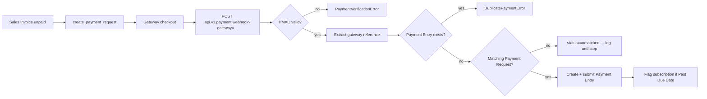

| Gateway | Signature scheme | Amount units |
|---|---|---|
| Razorpay | `HMAC-SHA256(raw_body)` | paise → ÷100 |
| Stripe | `HMAC-SHA256("{t}." + raw_body)`, parsed from `t=`/`v1=` | cents → ÷100 |
| HitPay | `HMAC-SHA256(raw_body)` | major units |

Secrets resolve from `site_config.json` (`<gateway>_webhook_secret`) first,
falling back to the ERPNext Payment Gateway Account.

**An unmatched webhook creates nothing.** If the gateway reference matches no
Payment Request, the handler logs and returns `{"status": "unmatched"}` rather
than applying the payment to an arbitrary open invoice — which would mark an
unrelated customer's invoice paid.

**Coupons.** `validate_coupon_for_customer` enforces expiry, max-use, and
single-use-per-customer. `invoice_hooks.on_invoice_submit` records
`MSuite Coupon Usage` when a submitted Sales Invoice carries a coupon code.

---

## 15. Scheduled tasks

| Schedule | Entry point | Purpose |
|---|---|---|
| `*/5 * * * *` | `webhook.retry_pending_webhook_deliveries` | Re-attempt queued forwards whose backoff elapsed (200/tick) |
| hourly | `meta_social.retry_failed_page_subscriptions` | Re-subscribe Pages whose webhook subscription failed, e.g. after a token refresh — resumes DMs/comments without re-OAuth |
| daily | `daily.expire_trial_grants` | Expire trial grants, transition to paid or revoke |
| daily | `daily.reconcile_customer_groups` | Reconcile group membership over a 25-hour window |
| daily | `daily.sync_active_clients` | Push fresh plan data to every Active client |
| daily | `daily.refresh_expiring_tokens` | `refresh_all_tokens` — refresh, push, notify |
| daily | `gmail_relay.renew_gmail_watches` | Renew Gmail `users.watch` before its 7-day expiry |

Every daily task wraps its body in `try/except` + `frappe.log_error`, so one
failing job never aborts the scheduler run.

---

## 16. DocType reference

**Catalog (7)**

| DocType | Kind | Purpose |
|---|---|---|
| `MSuite Product` | `field:product_code` | Top-level sellable module |
| `MSuite Product Feature` | child | Feature definition — `feature_key`, `feature_label`, type |
| `MSuite Plan` | `field:plan_code` | Product × tier, with pricing/features/grants |
| `MSuite Plan Feature` | child | Per-plan toggle + `limit_value` + `limit_label` |
| `MSuite Plan Pricing` | child | Billing interval → rate → Item → Subscription Plan |
| `MSuite Plan Grant` | child | Complimentary-grant rule with optional expiry |
| `MSuite Bundle` + `Bundle Component` + `Bundle Pricing` | mixed | Multi-plan package |

**Entitlement (3)**

| DocType | Purpose |
|---|---|
| `MSuite Customer Grant` | `GRANT-#####` — the access record. Type, status, source subscription, trigger plan, expiry, revocation reason |
| `MSuite Customer Group Membership` | child on Customer — mirrors grants into ERPNext groups |
| `MSuite Coupon Usage` | `CUSG-#####` — coupon redemption ledger |

**Client and integrations (13)**

| DocType | Purpose |
|---|---|
| `MSuite Client` | One per customer site — URL, code, API key/secret, sync health |
| `MSuite App` | Platform app registration — `app_id`, `app_secret`, `config_id`, redirect/webhook URLs, `ai_backend_url`, `allow_coexistence` |
| `MSuite Auth Account` | Business/organisation level entity (Meta Business, Google account) |
| `MSuite Connected Account` | Per-asset row holding `access_token`/`refresh_token`, expiry, `needs_reauth`, subscription state, last inbound event |
| `MSuite WhatsApp Account` + `WhatsApp Phone` | WABA + phone numbers (quality rating, messaging tier) |
| `MSuite Facebook Account` | Page id/name/category, fan count, linked IG |
| `MSuite Instagram Account` | IG user id, username, followers, linked Page |
| `MSuite LinkedIn Page Account` | Organisation id/name/vanity |
| `MSuite LinkedIn Profile Account` | Person id/name/vanity |
| `MSuite Meta Ads Account` | Ad account id, currency, timezone, status |
| `MSuite Signup Consent` | Consent + scope + client-environment audit trail |
| `MSuite Webhook Delivery` | Durable forward record — status, attempts, backoff, idempotency key, payload |
| `MSuite AI DID` | `field:did` — DID → client routing registry |

`MSuite Customer Grant` is guarded by `permissions.has_permission`:
Administrator, **MSuite Manager**, or System Manager only.

---

## 17. API reference

All paths are `/api/method/msuite.api.v1.<module>.<method>`.

| Module | Method | Guest? | Purpose |
|---|---|---|---|
| `entitlement` | `get_entitlements` | no | Full resolved map |
| | `check_feature` | no | Single feature boolean + limit |
| | `get_active_plans` | no | Active plan names |
| | `invalidate_cache` | no | Force Redis flush |
| `plan` | `get_plans`, `get_plan_features`, `compare_plans` | no | Catalog |
| `bundle` | `get_bundles`, `get_bundle_features`, `get_bundle_details` | no | Bundle catalog |
| `subscription` | `create_subscription`, `cancel_subscription`, `amend_subscription`, `get_customer_subscriptions`, `get_billing_summary` | no | Lifecycle |
| `coupon` | `validate_coupon`, `get_applicable_coupons`, `get_usage_history` | no | Coupons |
| `payment` | `create_payment_request`, `get_payment_status` | no | Payments |
| | `webhook` | **yes** | Gateway callback (HMAC-verified) |
| `auth` | `start_auth` | no | Desk-session OAuth start |
| | `start_auth_for_client`, `finalize_linkedin_pages_for_client`, `list_configured_platforms_for_client`, `start_whatsapp_embedded_signup`, `auth_callback`, `exchange_whatsapp`, `get_connect_config`, `get_app_id_for_client`, `refresh_account_token`, `disconnect_account_for_client` | **yes** | Client-initiated flows (state- or credential-authenticated) |
| | `log_signup_event` | no | Consent audit |
| `webhook` | `receive_meta_whatsapp`, `receive_meta_social`, `receive_meta_catalogue`, `receive_gmail_push`, `receive_twitter_events`, `receive_linkedin*`, `deauthorize_callback` | **yes** | Platform ingress (signature-verified) |
| `ai_calling` | `get_ai_calling_config`, `get_s3_presigned_put`, `get_s3_presigned_get`, `register_did`, `get_inbound_config`, `get_config_by_did`, `create_call_log`, `update_call_log_recording`, `update_broadcast_recipient` | **yes** | Credential- or backend-key-authenticated |
| `gmail_relay` | `send_email`, `poll_new_messages` | **yes** | Credential-authenticated |

`allow_guest=True` never means unauthenticated. Each such endpoint performs its
own check — `require_msuite_client_auth`, `validate_provider_auth`, OAuth state
validation, `_require_backend_key`, or HMAC signature verification. Guest
access is required because the caller is another *server* (or an end-user
mid-OAuth), not a logged-in Frappe user.

---

## 18. Reports, workspace, patches

**Script Reports (4)**

| Report | Ref DocType |
|---|---|
| Active Subscriptions by Plan | Subscription |
| Plan Revenue Summary | Sales Invoice |
| Trial Conversion Rate | MSuite Customer Grant |
| Coupon Usage Summary | MSuite Coupon Usage |

**Modules (7)** — `MSuite Product`, `MSuite Plan`, `MSuite Bundle`,
`MSuite Customer Grant`, `MSuite Coupon Usage`,
`MSuite Customer Group Membership`, `MSuite Client`.

**Workspace** — a single public `MSuite` workspace under the
`MSuite Product` module.

**Patches** (`patches.txt`, all under `v1_0`): five product reseeds
(`social_post`, `ads`, `inbox`, `email`, `whatsapp`), `reseed_inbox_product_v2`,
`linkedin_unify_platform` (merged Page/Profile into one LinkedIn platform),
`rename_ai_calling_feature_keys` (`voice_blasts` → `broadcasts`,
`voice_blast_limit` → `broadcast_limit`, plus `limit_label` text fixes), and
`reparent_ai_calling_orphan_features` (folded the orphaned `AI_CALLING`
child rows into the live `AICALLING` product — re-parents any key the live
product lacks, and for a key it already has, repoints plan links onto the
surviving row before dropping the duplicate).

**Fixtures** — active `MSuite Product`, `MSuite Plan`, and `MSuite Bundle`
records export with the app.

---

## 19. Install and configuration

```bash
bench get-app msuite <repository-url>
bench --site <site> install-app msuite
```

`after_install` is fully idempotent — every step checks existence first:

1. Create the **MSuite Manager** role (with desk access)
2. Ensure ERPNext defaults (`UOM: Nos`, `Territory: All Territories`)
3. Custom fields on **Item** — `msuite_section`, `is_msuite_bundle`,
   `msuite_bundle`
4. Custom fields on **Customer** — hidden `msuite_memberships_section` +
   `msuite_group_memberships` child table
5. Create the root `MSuite` Customer Group
6. Item Groups — WhatsApp, Email, Social Post, Ads, Inbox, AI Calling, Bundles
7. Seed 6 Products, their Plans (with Items and Subscription Plans), and Bundles

Steps 6–7 are individually wrapped in `try/except` and print a warning rather
than aborting the install.

### Configuration checklist

1. **MSuite App** records per platform, with `app_id`, `app_secret`,
   `redirect_uri`, `webhook_verify_token`. Currently configured: AI Calling,
   LinkedIn, Twitter, WhatsApp (`Meta WhatsApp`), Social Dev (`Meta Social`),
   Email (`Google`).
2. **MSuite Client** per customer — set `client_url`, then activate to
   generate and push credentials.
3. **Payment gateways** — ERPNext Payment Gateway Accounts plus webhook
   secrets.
4. **`site_config.json`**:

```jsonc
{
  "razorpay_webhook_secret": "…",
  "stripe_webhook_secret":   "…",
  "hitpay_webhook_secret":   "…",
  "gmail_pubsub_topic":      "projects/<proj>/topics/<topic>"
}
```

### Key constants (`constants.py`)

| Constant | Value |
|---|---|
| `ENTITLEMENT_CACHE_TTL_SECONDS` | 3600 |
| `OAUTH_STATE_TTL_SECONDS` | 600 |
| `LINKEDIN_PENDING_TTL_SECONDS` | 600 |
| `TOKEN_REFRESH_BUFFER_DAYS` | 7 |
| `TRIAL_DEFAULT_DAYS` | 14 |
| `GRANT_RECONCILIATION_WINDOW_HOURS` | 25 |
| `CLIENT_SYNC_MAX_FAILURES` | 3 |
| `MAX_FORWARD_ATTEMPTS` (webhook.py) | 8 |
| `GRAPH_API_VERSION` | `v25.0` |

---

## 20. Known issues and sharp edges

Verified against the code and the live `mp.localhost` database on
2026-08-07. Listed so they are not rediscovered as surprises.

### Open

| # | Issue | Impact |
|---|---|---|
| 1 | **TikTok is declared but not implemented.** `Platform.TIKTOK` exists in `constants.py`, but there is no `tiktok.py` and no registry entry. | `is_platform_supported("tiktok")` is `False`, so the Connect page correctly greys the card. Nothing breaks; the constant is aspirational. |
| 2 | **`limit_value = 0` reads as unlimited.** `if row.limit_value else None` treats `0` as falsy, and the merge treats `None` as unlimited. | **Deliberately left as-is.** The column is `decimal(21,9) NOT NULL DEFAULT 0`, so it is never `NULL` and cannot distinguish "no cap set" from "explicitly zero" — 249 of 315 rows sit at `0`, 178 of them enabled and meaning *unlimited*. Switching the check to `is not None` would resolve those 178 to `limit = 0` across all 30 plans, which the client reads as **disabled** (`plan_enforcer.py`: "None = unlimited, 0 = disabled"). Expressing a true zero needs a schema-level sentinel (e.g. a `no_limit` check field) plus a backfill, not a one-line change. |
| 3 | **Reverse proxy assumes a single active client** and falls back to `http://localhost:8001`. See §13. | Correct for the current one-client deployment; would misroute with two. |
| 4 | **Redundant post-hook calls.** `on_subscription_created` calls `sync_groups_for_subscription` and `invalidate_entitlement_cache`, which `apply_grants_for_subscription` already did internally. | Idempotent, so only a minor duplicate cost. |
| 5 | **`_seed_products` docstring says "5 MSuite Products"** but seeds 6 (AI Calling was added later). | Comment only. |

### Resolved on 2026-08-07

| Issue | Resolution |
|---|---|
| 12 orphan `MSuite Product Feature` rows under a non-existent `AI_CALLING` product | Patch `reparent_ai_calling_orphan_features`. `AICALLING` already held all 12 keys and every one of the 60 AI Calling plan-feature rows linked to *its* docnames, so the orphans were redundant rather than load-bearing. The patch repoints any plan link onto the surviving row, then removes the duplicate. Apparent key collisions dropped from 18 to the 6 genuine ones. |
| Duplicate workspace JSON | `msuite/workspace/msuite/msuite.json` deleted. The live record (24 links, 23 shortcuts) is defined by `msuite_product/workspace/msuite/msuite.json` and survives `bench migrate` unchanged. |
| `meta_base` used without an explicit import | `from . import meta_base` added to `services/oauth/__init__.py`, so `_TOKEN_REFRESHERS` no longer depends on another handler's import binding the submodule as a side effect. |
| `proxy.py` routed dead `paideia_crm.*` paths | Prefix removed. `paideia_crm` is installed on neither bench, so those requests were being proxied to an endpoint that does not exist. |

---

## License

MIT
